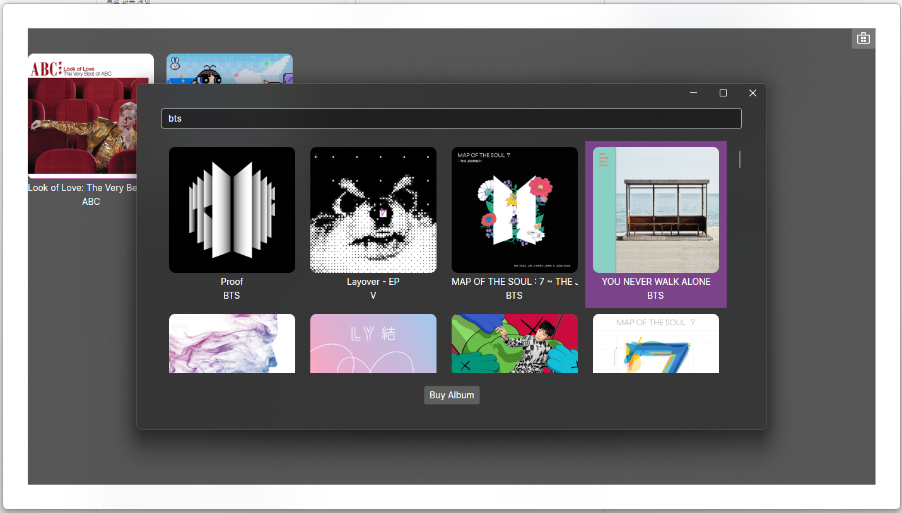
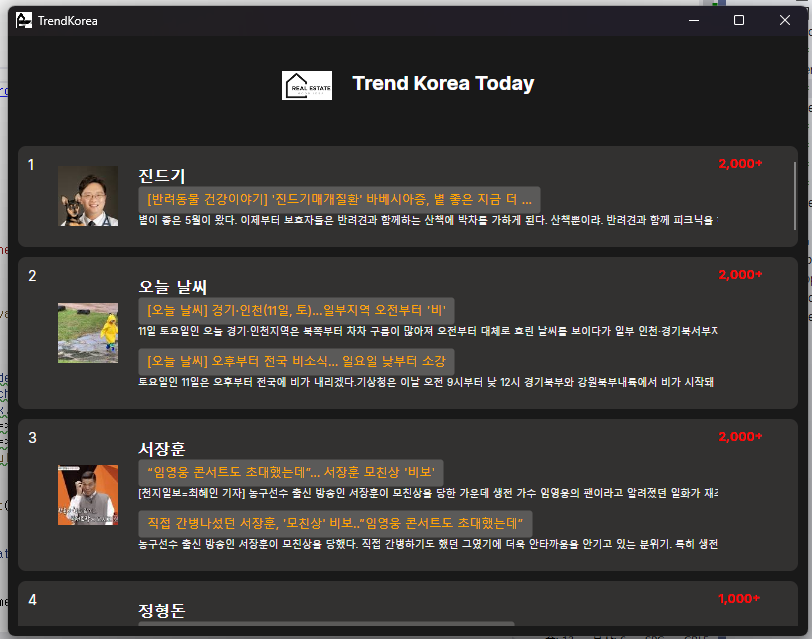
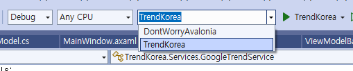

# Intro

### 개발 정보
프로젝트 명 : .NET 크로스 플랫폼 앱 개발  
기관/행사 : OSS [link](https://www.oss.kr/) / [컨트리뷰톤]2024 오픈소스 컨트리뷰션 아카데미 [체험형-1차] [link](https://www.oss.kr/notice/show/1e2a5e1f-3f39-4d60-8ff9-034eec08b014)  
기간 : 24.04.22 ~ 24.05.13  
멘토 : 소현섭 멘토님 [linkedin](https://www.linkedin.com/in/sohyeonseop/?originalSubdomain=kr)

### 프로젝트 1. 뮤직 스토어

### 설명
애플뮤직 스토어에서 음악 리스트를 검색하고 이를 갖고옵니다. 
갖고온 음악 리스트 중 하고자 하는 목록을 클릭하면 자동으로 내 음악 리스트에 추가됩니다. 
한 번 추가한 항목은 그 다음 실행에서도 확인할 수 있습니다. 
 
 

### 프로젝트 2. 트렌드 코리아

### 설명
구글 트렌드 RSS의 데이터를 활용해 현재 한국의 트렌드를 한 눈에 볼 수 있습니다. 
버튼을 클릭시 해당 뉴스로 페이지를 이동합니다. 

 
 

# 실행방법

프로젝트에서 실행하고자 하는 프로젝트를 선택하고 `Ctrl + F5`를 클릭해서 실행합니다.

# 사용기술

- AsyncImageLoader.Avalonia : 3.2.1
- Avalonia : 11.0.10

# Resource
Avalonia 웹 아이콘 : https://avaloniaui.github.io/icons.html  
Data Template : https://docs.avaloniaui.net/docs/concepts/templates/ 
Data Resources : 
  - iTunesSearch(nuget package)
  - Google Trend [link](https://trends.google.co.kr/trends/trendingsearches/daily/rss?geo=KR)
